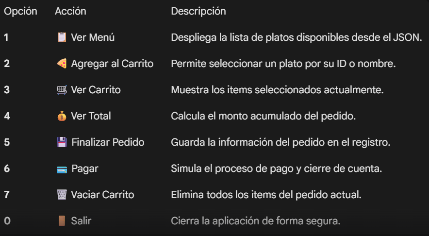

🍗 Sistema de Gestión Gastronómica: Molipollo v1.0
Este proyecto es una implementación integral en Python diseñada para la administración de flujos de trabajo en un entorno restaurantero. No se trata solo de un script de terminal, sino de un ecosistema que integra la manipulación de estructuras de datos dinámicas con persistencia de archivos JSON, simulando un entorno de producción real.

------

🏛️ Arquitectura y Lógica del Sistema
El software se divide en una estructura modular para garantizar la escalabilidad y el orden del código:

indice.py (Core Engine): Actúa como el controlador principal. Gestiona el bucle infinito (while True) que mantiene la aplicación activa y procesa las entradas del usuario.

funciones.py (Business Logic): Contiene la inteligencia del sistema. Aquí se definen los algoritmos para el cálculo de costos, la manipulación de listas y la gestión de entrada/salida (I/O) de archivos.

Archivos de Datos (JSON): Se utilizan tres bases de datos relacionales simples:

menu.json: Catálogo de productos.
pedidos.json: Registro histórico de órdenes confirmadas.
pagos.json: Bitácora transaccional de cobros realizados.

------

🛠️ Estructura del Menú
El software se maneja a través de una interfaz de consola organizada de la siguiente manera:

------
🚀 Funcionalidades

1. Gestión de Persistencia JSON
El sistema demuestra cómo interactuar con archivos externos de manera segura. Mediante la librería json, el programa es capaz de:

Deserializar: Convertir archivos de texto en listas y diccionarios de Python (cargar_menu).
Serializar: Guardar nuevos registros sin sobrescribir la data histórica (guardar_pedido).

2. Algoritmos de Carrito de Compras
Se implementa una lógica de acumulación dinámica. El carrito es una lista de diccionarios que crece en tiempo de ejecución.

Control de Cantidades: Validación de entradas para evitar valores negativos.

Cálculo Transaccional: Uso de acumuladores para determinar el total_general mediante iteraciones (for, item, in, carrito).

Alineación tabular: Uso de f-strings con formatos como {nombre:<25} para crear tablas alineadas en la terminal.

Representación monetaria: Formateo de miles con comas para facilitar la lectura de precios.

------

👨‍💻 Autores

Isabela Carrillo Azain
